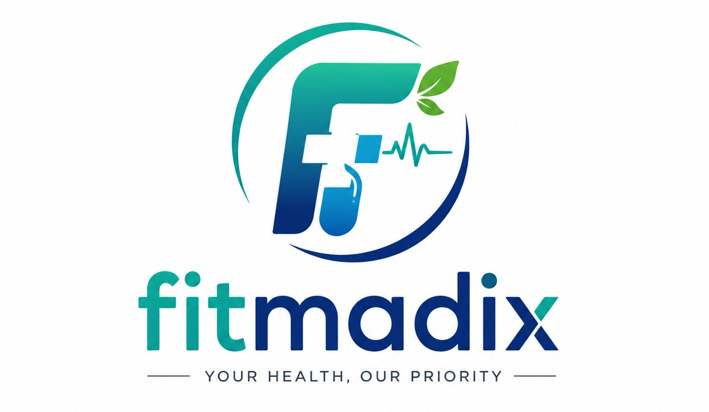

<p align="center">
  
</p>

<h1 align="center">Fitmedix</h1>

<p align="center">
  <strong>Your Health, Our Priority</strong><br/>
  An AI-powered medical health platform for holistic wellness management.
</p>

<p align="center">
  <a href="#features">Features</a> •
  <a href="#tech-stack">Tech Stack</a> •
  <a href="#project-structure">Project Structure</a> •
  <a href="#getting-started">Getting Started</a> •
  <a href="#environment-variables">Environment Variables</a> •
  <a href="#api-reference">API Reference</a> •
  <a href="#mobile-bridge">Mobile Bridge</a> •
  <a href="#contributing">Contributing</a>
</p>

---

## Overview

**Fitmedix** is a comprehensive medical health application that combines AI-driven health guidance, wearable device integration, and personalized health tracking into a single platform. Built with **Next.js 16** for the web and **Expo/React Native** for mobile, it offers a seamless cross-platform experience.

---

## Features

### 🤖 AI Health Guide
- Conversational AI assistant powered by **Google Gemini**, **OpenAI**, and **Anthropic Claude**
- Medical report translation and summarization
- AI-powered consultation summaries

### 💊 Medicine & Disease Management
- Medicine database with scheduling and reminders
- Disease encyclopedia with detailed information
- **Chronotherapy** — optimally timed medication schedules based on circadian rhythms

### 🏋️ Fitness & Wellness
- Exercise library with guided routines
- **Yoga pose** database and guided sessions
- Workout logging and tracking
- Personalized diet plans and meal logging

### 📊 Health Monitoring
- **Google Fit** integration for real-time health metrics
- **Smartwatch / Bluetooth** wearable dashboard
- Daily health check-ins with trend tracking
- Health records management and medical ID

### 🔐 Privacy & Security
- **Z-PECT** zero-knowledge proof verification for data privacy
- Encrypted token vault for OAuth credentials
- Secure health data transmission (HDT) pipeline
- Exposome environmental health snapshot tracking

### 📱 Cross-Platform
- Responsive web app with mobile-first design
- Native mobile bridge via **Expo / React Native**
- **Apple HealthKit** & **Google Health Connect** integration
- Push notifications for medication reminders and health alerts

### 🌐 Multilingual
- Built-in language context for internationalization support

### 🔍 Smart Search
- Global search across medicines, diseases, exercises, diets, and more

---

## Tech Stack

| Layer         | Technology                                                     |
| ------------- | -------------------------------------------------------------- |
| **Frontend**  | Next.js 16 (Turbopack), React 19, Tailwind CSS 4              |
| **Backend**   | Next.js API Routes (App Router)                                |
| **Database**  | MongoDB (Mongoose), Supabase (PostgreSQL)                      |
| **Auth**      | NextAuth.js, JWT, bcrypt, Google OAuth 2.0                     |
| **AI/ML**     | Google Gemini, OpenAI, Anthropic Claude                        |
| **Mobile**    | Expo 57, React Native 0.86, Expo Router                        |
| **Wearables** | Google Fit API, Apple HealthKit, Health Connect, Web Bluetooth  |
| **Realtime**  | Push Notifications (web-push), Cron jobs                       |
| **Security**  | Z-PECT zero-knowledge proofs, AES encryption, Secure Vault     |
| **Email**     | Nodemailer                                                     |

---

## Project Structure

```
Fitmedix/
├── fitmadix-app/                # Main Next.js web application
│   ├── src/
│   │   ├── app/                 # App Router pages & API routes
│   │   │   ├── api/             # 30+ REST API endpoints
│   │   │   ├── ai-guide/        # AI health assistant
│   │   │   ├── consultations/   # Doctor consultation management
│   │   │   ├── daily-checkin/   # Daily health check-in
│   │   │   ├── diets/           # Diet plans
│   │   │   ├── diseases/        # Disease encyclopedia
│   │   │   ├── exercises/       # Exercise library
│   │   │   ├── health-records/  # Medical records
│   │   │   ├── log-meal/        # Meal logging
│   │   │   ├── log-medication/  # Medication tracking
│   │   │   ├── medical-id/      # Emergency medical ID
│   │   │   ├── medicine/        # Medicine database
│   │   │   ├── report-translator/ # AI report translation
│   │   │   ├── scan/            # Document scanning
│   │   │   ├── schedule/        # Appointment scheduling
│   │   │   ├── yoga/            # Yoga pose library
│   │   │   └── ...
│   │   ├── components/          # Reusable React components
│   │   ├── lib/                 # Utilities, DB config, services
│   │   ├── models/              # Mongoose data models (20+)
│   │   └── utils/               # Helper utilities
│   ├── mobile-bridge/           # Expo/React Native mobile app
│   │   ├── src/                 # Mobile app source
│   │   ├── assets/              # Mobile assets
│   │   └── app.json             # Expo configuration
│   ├── public/                  # Static assets
│   └── secure_vault/            # Encrypted credential storage
├── fit medix documentaition/    # Project documentation
└── README.md                    # ← You are here
```

---

## Getting Started

### Prerequisites

- **Node.js** ≥ 18.x
- **npm** ≥ 9.x
- **MongoDB** (local or [Atlas](https://www.mongodb.com/atlas))
- **Supabase** project ([supabase.com](https://supabase.com))

### Installation

1. **Clone the repository**

   ```bash
   git clone https://github.com/sharmaprem3010-netizen/Fitmedix.git
   cd Fitmedix
   ```

2. **Install dependencies**

   ```bash
   cd fitmadix-app
   npm install
   ```

3. **Set up environment variables**

   ```bash
   cp .env.example .env.local
   ```

   Fill in the required values (see [Environment Variables](#environment-variables) below).

4. **Start the development server**

   ```bash
   npm run dev
   ```

5. **Open in browser**

   Navigate to [http://localhost:3000](http://localhost:3000)

---

## Environment Variables

Create a `.env.local` file in the `fitmadix-app/` directory:

| Variable                        | Description                          | Required |
| ------------------------------- | ------------------------------------ | :------: |
| `MONGODB_URI`                   | MongoDB connection string            |    ✅    |
| `GEMINI_API_KEY`                | Google Gemini API key                |    ✅    |
| `JWT_SECRET`                    | Secret for JWT token signing         |    ✅    |
| `NEXTAUTH_SECRET`               | NextAuth.js secret                   |    ✅    |
| `NEXTAUTH_URL`                  | App URL (`http://localhost:3000`)     |    ✅    |
| `GOOGLE_CLIENT_ID`              | Google OAuth client ID               |    ⚙️    |
| `GOOGLE_CLIENT_SECRET`          | Google OAuth client secret           |    ⚙️    |
| `GOOGLE_REDIRECT_URI`           | Google OAuth redirect URI            |    ⚙️    |
| `ZPECT_TOKEN_ENCRYPTION_KEY`    | Z-PECT token encryption key          |    ⚙️    |
| `NEXT_PUBLIC_SUPABASE_URL`      | Supabase project URL                 |    ⚙️    |
| `NEXT_PUBLIC_SUPABASE_ANON_KEY` | Supabase anon key                    |    ⚙️    |

> ✅ = Required for core functionality &nbsp;|&nbsp; ⚙️ = Required for specific features

---

## API Reference

The app exposes **30+ API endpoints** under `/api/`:

| Endpoint                 | Method | Description                        |
| ------------------------ | ------ | ---------------------------------- |
| `/api/auth/[...nextauth]`| ALL    | Authentication (NextAuth.js)       |
| `/api/chat`              | POST   | AI health guide conversation       |
| `/api/medicines`         | GET    | List all medicines                 |
| `/api/diseases`          | GET    | List all diseases                  |
| `/api/exercises`         | GET    | List all exercises                 |
| `/api/diets`             | GET    | List all diet plans                |
| `/api/yoga`              | GET    | List yoga poses                    |
| `/api/daily-checkin`     | POST   | Submit daily health check-in       |
| `/api/consultations/*`   | ALL    | Consultation management & AI summary |
| `/api/schedule`          | ALL    | Appointment scheduling             |
| `/api/health-metrics`    | GET    | Health metrics aggregation         |
| `/api/google-fit`        | ALL    | Google Fit data integration        |
| `/api/watch-data`        | ALL    | Smartwatch data ingestion          |
| `/api/medical-reports`   | ALL    | Medical report management          |
| `/api/translate-report`  | POST   | AI-powered report translation      |
| `/api/notifications`     | ALL    | Push notification management       |
| `/api/search`            | GET    | Global search                      |
| `/api/chronotherapy`     | ALL    | Circadian-optimized dosing         |
| `/api/zpect_*`           | ALL    | Z-PECT privacy verification        |

---

## Mobile Bridge

The `mobile-bridge/` directory contains an **Expo/React Native** app that serves as the native mobile companion.

### Setup

```bash
cd fitmadix-app/mobile-bridge
npm install
```

### Run

```bash
npx expo start          # Start Expo dev server
npx expo start --android  # Android
npx expo start --ios      # iOS
```

### Key Integrations

- **Apple HealthKit** (`react-native-health`) — iOS health data
- **Health Connect** (`react-native-health-connect`) — Android health data
- **Expo Router** — File-based navigation
- **React Native Reanimated** — Smooth animations

---

## Scripts

| Command          | Description                  |
| ---------------- | ---------------------------- |
| `npm run dev`    | Start development server     |
| `npm run build`  | Build for production         |
| `npm run start`  | Start production server      |
| `npm run lint`   | Run ESLint                   |

---

## Data Models

The app uses **20 Mongoose models** for structured health data:

| Model                  | Purpose                                    |
| ---------------------- | ------------------------------------------ |
| `User`                 | User accounts and profiles                 |
| `Medicine`             | Medicine database entries                  |
| `Disease`              | Disease information                        |
| `Exercise`             | Exercise routines                          |
| `Diet`                 | Diet plans and nutrition                   |
| `YogaPose`             | Yoga pose library                          |
| `Schedule`             | Appointments and reminders                 |
| `DailyCheckin`         | Daily health check-in logs                 |
| `Consultation`         | Doctor consultation records                |
| `HealthRecord`         | Medical history records                    |
| `MedicalReport`        | Uploaded medical reports                   |
| `WatchData`            | Smartwatch/wearable data                   |
| `ChronotherapyDecision`| Circadian-optimized medication timing      |
| `ExposomeSnapshot`     | Environmental health exposure data         |
| `HdtSignal`            | Health data transmission signals           |
| `Notification`         | Push notification records                  |
| `PushSubscription`     | Web push subscription storage              |
| `OAuthCredential`      | Encrypted OAuth tokens                     |
| `QA`                   | Q&A knowledge base                         |
| `Settings`             | User preferences and app settings          |

---

## Contributing

1. Fork the repository
2. Create your feature branch: `git checkout -b feature/amazing-feature`
3. Commit your changes: `git commit -m 'Add amazing feature'`
4. Push to the branch: `git push origin feature/amazing-feature`
5. Open a Pull Request

---

## License

This project is private and proprietary.

---

<p align="center">
  Built with ❤️ by the <strong>Fitmedix</strong> team
</p>
