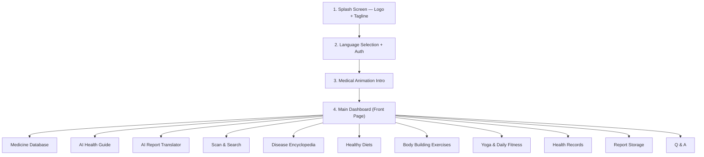

# Fitmadix — Medical Health App

**"YOUR HEALTH, OUR PRIORITY"**

A premium, mobile-first medical web application with a teal/navy gradient design system, inspired by the provided reference screenshots and handwritten feature notes.

---

## App Flow (from your handwritten notes)

---

## Proposed Changes

This will be built as a **single HTML file + CSS file + JS file** for simplicity, with all pages/screens handled via in-app routing (SPA style). No framework — pure HTML/CSS/JS for maximum portability.

### Design System & Branding

- **Primary color**: Teal gradient (`#00B4D8` → `#0077B6`)
- **Secondary color**: Navy blue (`#023E8A`)
- **Accent**: Leaf green (`#2DC653`)
- **Background**: Clean white with subtle blue-tinted cards
- **Typography**: Google Font "Inter" for body, "Outfit" for headings
- **Mobile-first**: Max-width 430px centered viewport (phone simulation), fully responsive
- **Glassmorphism cards**, smooth micro-animations, pulse/heartbeat effects

---

### Screen-by-Screen Breakdown

#### Screen 1 — Splash Screen
- Full-screen teal-to-navy gradient
- Fitmadix logo (the provided logo image) centered with pulse animation
- Tagline "YOUR HEALTH, OUR PRIORITY" with fade-in
- Auto-advances after 3 seconds

#### Screen 2 — Language Selection + Login
- Language selector dropdown (English, Hindi, Nepali, etc.)
- User details form: Name, Surname, Address
- Login options: Gmail button + Phone Number input
- "Continue" button with ripple effect

#### Screen 3 — Medical Animation Onboarding
- 3-slide carousel (similar to reference image 3):
  - Slide 1: "Join our health community" with medical illustration
  - Slide 2: "Track your health metrics" 
  - Slide 3: "Connect with top doctors"
- Dot indicators, "Next" / "Get Started" buttons
- CSS animations for slide transitions

#### Screen 4 — Main Dashboard (Home)
Based on reference images 2 & 3, includes:
- **Header**: "Hello, [User Name]" + avatar + notification bell
- **Search bar**: "Search Medical..." with filter icon
- **Services grid** (icon cards for all 11 features):
  1. 💊 Medicine Info
  2. 🤖 AI Guide
  3. 📋 Report Translator
  4. 📷 Scan & Search
  5. 🦠 Disease Info
  6. 🥗 Healthy Diets
  7. 💪 Body Building
  8. 🧘 Yoga & Fitness
  9. ❤️ Health Records
  10. 📁 Report Storage
  11. ❓ Q & A
- **Health Stats Banner**: Heart rate, blood group, weight cards (from ref image 2 right screen)
- **Upcoming Appointments** section with doctor cards
- **Bottom navigation**: Home, Schedule, Records, Notifications

#### Screen 5 — Medicine Database
- Search bar for medicine name
- Medicine cards with:
  - Medicine name & generic name
  - Expiry date
  - Usage instructions ("When to use")
  - Side effects & dangerous effects
  - Dosage info
- Pre-loaded sample data for demo

#### Screen 6 — AI Health Guide
- Chat-style interface
- AI avatar with typing indicator animation
- Sample health questions/answers
- Quick-action suggestion chips ("Check Symptoms", "Diet Plan", "Exercise Tips")

#### Screen 7 — AI Report Translator
- Upload area (drag & drop) for medical reports
- Language selector for translation target
- Translated report display area
- Demo mode with sample report

#### Screen 8 — Scan & Search
- Camera/upload button for scanning medicine packaging
- Image preview area
- Results card showing identified medicine info
- Demo with sample scan result

#### Screen 9 — Disease Encyclopedia
- Alphabetical disease listing with search
- Disease detail cards:
  - Disease name & category
  - Symptoms list
  - Treatment steps ("How to cure it — the right steps")
  - Prevention tips
- Sample diseases pre-loaded

#### Screen 10 — Healthy Diets
- Diet plan cards (Vegetarian, Keto, Balanced, etc.)
- Daily meal planner (Breakfast, Lunch, Dinner, Snacks)
- Calorie/nutrition info
- Visual food images

#### Screen 11 — Body Building Exercises
- Exercise categories (Chest, Arms, Legs, Core, Back)
- Exercise cards with name, sets/reps, difficulty
- Animated exercise illustrations (CSS)
- Workout timer

#### Screen 12 — Yoga & Daily Fitness
- Yoga pose cards with difficulty levels
- Daily fitness routine
- Timer/stopwatch for practice
- Progress tracking ring chart

#### Screen 13 — Health Records
- Health checkup history cards
- Vital stats (BP, Sugar, Cholesterol, etc.) with trends
- Add new record form
- Chart/graph visualizations

#### Screen 14 — Report Storage
- File manager style interface
- Folders: "General Health", "Diabetes", "Blood Reports", etc. (from ref image 2)
- Upload report functionality
- File count per folder
- Easy to handle, organized layout

#### Screen 15 — Q & A Section
- FAQ accordion with common health questions
- "Ask a Question" form
- Community answers with upvote
- Categories filter

#### Screen 16 — Health Status Dashboard (from ref image 4 right screen)
- Heart rate monitor with animated line chart
- Sleep tracker
- Water intake tracker
- BMI card
- Steps counter
- Weekly/daily statistics bar charts

---

### File Structure

#### [NEW] [index.html](file:///c:/Users/sharm/OneDrive/Desktop/Fitmedx/index.html)
Main HTML file with all screen structures, semantic elements, SEO meta tags, Google Fonts imports.

#### [NEW] [styles.css](file:///c:/Users/sharm/OneDrive/Desktop/Fitmedx/styles.css)
Complete design system — CSS variables, animations, all screen layouts, responsive styles, glassmorphism effects, gradients.

#### [NEW] [app.js](file:///c:/Users/sharm/OneDrive/Desktop/Fitmedx/app.js)
SPA router, screen transitions, form handling, localStorage for data persistence, interactive widgets (charts, timers, counters), sample data.

---

## User Review Required

> [!IMPORTANT]
> **Logo Image**: I'll use the Fitmadix logo you provided (`WhatsApp Image 2026-06-18 at 6.23.30 PM.jpeg`) on the splash screen. Should I also generate additional medical illustrations for the onboarding slides?

> [!IMPORTANT]
> **Data Persistence**: This will use `localStorage` for storing user data, health records, and reports. For a production version you'd need a backend — but this gives you a fully working demo.

> [!WARNING]
> **AI Features**: The "AI Guide" and "AI Report Translator" will be simulated with pre-built responses for the demo. Real AI integration would require a backend API (e.g., Gemini API). Should I simulate them for now, or do you want me to integrate an actual AI API?

## Open Questions

1. **App Name**: Your logo says "fitmadix" but the folder is "Fitmedx". Which name should I use throughout the app?
2. **Language**: You mentioned language selection — which languages should be available? (English, Hindi, Nepali, others?)
3. **Color preference**: The references show both teal/green and blue/white themes. I'm planning teal-to-navy gradient to match your logo. Is that correct?

## Verification Plan

### Manual Verification
- Open `index.html` in browser and navigate through all screens
- Test all interactive elements (buttons, forms, navigation)
- Verify mobile responsiveness
- Check all animations and transitions
- Test data persistence (localStorage)
